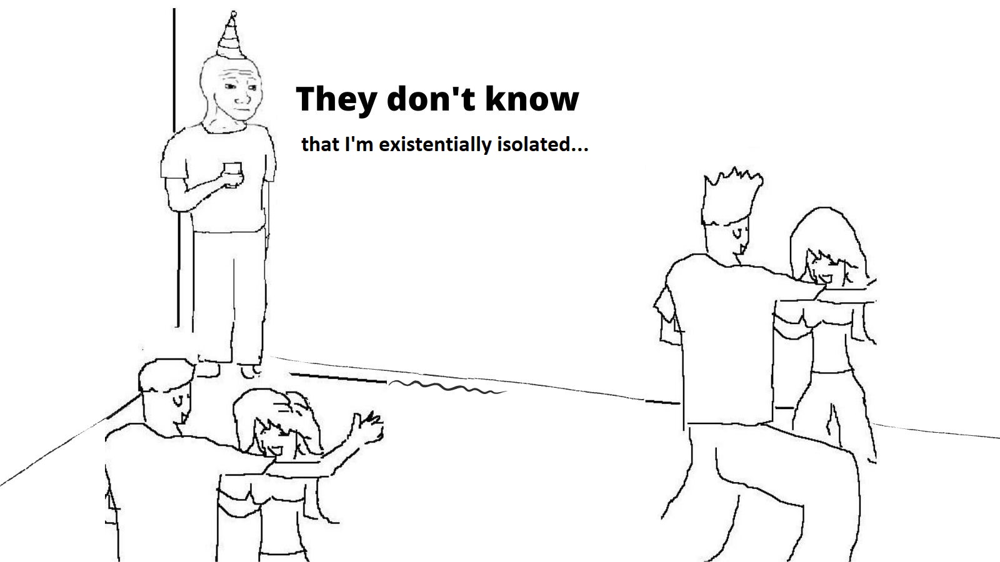

# EI-and-Precarious-Manhood

### This project seeks to examine whether normative conceptions of masculinity are the underlying mechanism of the finding that men tend to experience more existential isolation (EI) than women. Existential isolation is the feeling of being subjctively alone in one's experiences. For example, not laughing at a joke that a group of people you're with would be an existentially isolating experience. Everyone experiences EI to some degree or another, but for those who are more existentially isolated, two fundamental human needs are stymied: the need to know and the need to belong. Thus, for some, EI is psychologically damaging and can have negative donwstream outcomes such as loneliness, depression, and anxiety.

### In the West, men consistently report more EI than women. Previous research has suggested that this is driven largely by men's relatively lower endorsement of communal values. That is, men, compared to women, tend to report that they value communality less, and this in turn predicts men's endorsement of EI. However, in a previous study, we attempted to replicate these findings, and found that it was not communal norms that differentiated men and women, but rather a mismatch between participants' self-reported precariousness manhood (PM) beliefs and the extent to which they believed society endorsed PM. Precarious manhood is the idea that manhood, compared to womanhood, is a tenuous, desirable status that must be earned, is socially conferred, and can easily be lost. In our previous study, men who did not endorse PM beliefs but believed they were prevalent in American society were significantly higher in EI than those who endorsed PM beliefs or those who did not believe they were societally prevalent.

### This study is a follow-up to attempt to replicate our previous findings and determine if it is in fact the disconnect between self-endorsed PM and beliefs about others PM that drives EI, or whether there is a simpler explanation: that generalized false consensus beliefs account for men's EI. Over the course of 3 semesters, we sampled 291 college students on a variety of scales, including EI, PM self beliefs, PM beliefs among close friends/family, PM beliefs in society, conformity to masculine norms, communality, interdependence, loneliness, and aggression.

### **False Consensus Items**

1. I have no fear of spiders.
2. I think that I would like the kind of work that a forest ranger does.
3. I think most people would lie to get ahead.
4. Criticism or scolding hurts me terribly.